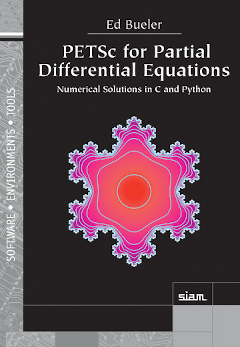

p4pdes
======

_PETSc for Partial Differential Equations_ is a book on using [PETSc](https://petsc.org/release/) and [Firedrake](https://www.firedrakeproject.org/) to solve [partial differential equations](https://en.wikipedia.org/wiki/Partial_differential_equation) by modern numerical methods.

  

Order a paper copy from [SIAM Press](https://doi.org/10.1137/1.9781611976311), or the e-book from [Google Play](https://play.google.com/store/books/details/Ed_Bueler_PETSc_for_Partial_Differential_Equations?id=tgMHEAAAQBAJ).

This repository contains the C and Python example programs upon which the book is based.

**These example programs will remain here for the long term, and they will be maintained for future versions of PETSc.**

### C examples

To compile and run the C examples, for Chapters 1 through 12, see the [`README.md`](c/README.md) in the `c/` directory.

### Python/Firedrake examples

Chapters 13 and 14 use [Firedrake](https://www.firedrakeproject.org/), a [Python](https://www.python.org/) finite element library based on PETSc.  See the [`README.md`](python/README.md) in the `python/` directory to run these examples.

